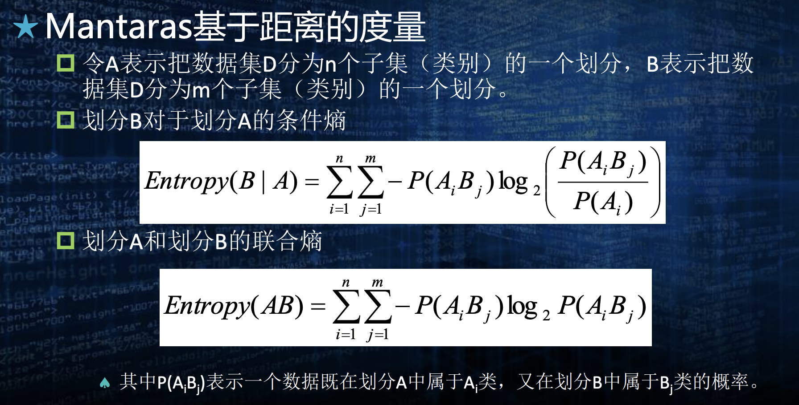

## Chap. 1

**机器学习的基本问题**
- 分类
- 预测
- 聚类
- 联想/关联: 相关性分析
- 优化

**机器学习的基本方式**

|       | 解决问题           |
| ----- | -------------- |
| 有监督学习 | 分类, 预测         |
| 无监督学习 | 聚类             |
| 半监督学习 | 分类, 预测         |
| 自监督学习 | 特征学习           |
| 强化学习  | 最优决策问题, 学习优化模式 |

**基本过程**

- 收集数据
- 清洗数据
- 提取特征
- 训练模型
- 获得知识(测试, 验证, 评估, 解释, 提高泛化性)

***QA: 机器学习有哪些学习方式？这些学习方式的区别是什么?***
- 有监督学习 
- 无监督学习 
- 半监督学习 
- 自监督学习 
- 强化学习

## Chap. 2
**数据的属性的类型**
- 名词属性
- 顺序属性
- 区间属性
- 比值属性

- 离散/连续属性

**数据类型**
- 记录数据
- 图数据
- 有序数据: 时间/空间顺序
	- 序列数据
	- 时序数据
	- 空间数据
> 并非绝对分类, 视频是记录数据&有序数据的综合类型

**数据预处理 -- 归一化**
- 线性归一化
- Z-Score标准化
- 其他方法: 高斯函数, sigmoid 函数, softmax 函数

**度量**

- 相异性度量
	- 明科夫斯基距离: 距离的通式 $(\sum_k|p_k-q_k|^{r})^{\frac{1}{r}}$
		- r=1: 曼哈顿距离
		- r=2: 欧几里得距离
		- r=$\infty$: $L_{max}/L_{\infty}$ 范数
	- L0范数: 非0值的个数
- 距离度量
	- 马氏距离: 借助协方差矩阵的逆来定义
		- 优点: 量纲; 排除变量相关性
		- 缺点: 不绝对(相对性), 不稳定(不鲁棒); 不一定存在
	- 度量公理: 必须满足非负性, 对称性, 三角不等式
- 相似性度量一般有: 最大相似度(相似度为1等价于二者相等), 对称性
	- 余弦相似度(向量) 
	- 距离倒数: $\frac{1}{1+d}$
	- 杰卡德系数 J(离散集合): 对应杰卡德距离(1-J)是度量. $\frac{|A \cap B|}{|A \cup B|}$
	- Tanimoto系数(向量): 类似杰卡德系数, 用于向量. $\frac{p\cdot q}{|p|^2+|q|^2-p\cdot q}$, 对应的Tanimoto距离 **不是** 度量
	- Dice系数(离散集合)
	- 皮尔逊相关系数(变量): 
	- 斯皮尔曼相关系数
- 熵: $H(p)=-\sum_i p_i\log p_i$
	- 交叉熵: $-\sum_i(p_i\log q_i)$
	- KL散度: $\sum_i(p_i\log\frac{p_i}{q_i})$
	- 互信息: $\sum_x\sum_y p(x,y)\log\frac{p(x,y)}{p(x)p(y)}$
		- 对称性
		- 非负性
		- X,Y完全无关 -> I=0
		- X,Y完全相关 -> I=H(X)=H(Y)

**评估原则**
- 学习结果的合理性和有效性: 泛化能力越强越好
	- 鲁棒性/健壮性: 处理非正常数据的能力
- 算法复杂度
	- 时间复杂度, 空间复杂度: 简化问题, 降低要求/空间换时间/用并行化算法，提高并行度
	- 模型适应性
	- 模型描述的简洁性和可解释性

**数据**
- 保留法
- 交叉验证法
- 随机法

**度量学习结果有效性的常用指标**
- 误差
- MSE, MAE
- 精度, 召回率
- 特异度
- 假阳性/假阴性率: 对于一个真阴性/阳性样本, 猜错的概率
- ROC曲线: 不同判断标准下的假阳性率 - 真阳性率 (给负样本猜错的概率 - 给正样本猜对的概率)
- AUC: Area Under ROC Curve
- $F_\beta$度量: 精度和召回率的加权调和平均数: $\frac{(\beta^2+1)precision \times recall}{\beta^2 precision + recall}$

**多分类学习问题**
- 微平均法
- 宏平均法
- 混淆矩阵, label-prediction

## Chap. 3 分类算法

**KNN**

**决策树**
- 样本: $S$
- ID3算法基本原理: 每次选一个 **最佳分类属性**, 将样本按该属性的取值种类分类, 最后用剩余样本中的比例最大的类别作为这条路径的分类结果
- 避免过拟合的方法: 选择更小的树
	- 及早停止树的增长: 精确地估计何时停止树增长很 困难
	- 后修建: 用的多
- 如何选择最佳分类属性
	- 熵: 样本集作为分布, 随机变量为目标label, 样本比例近似概率
	1. 信息增益: 样本集S, 用属性A分类后的信息增益, $Gain(S,A)=Entropy(S) - \sum_{v\in Values(A)}\frac{|S_v|}{|S|}Entropy(S_v)$
	2. 增益比率: $GainRatio{S,A}=\frac{Gain(S,A)}{SplitInformation(S,A)}, SplitInformation(S,A)=-\sum_{v\in Values(A)}\frac{|S_v|}{|S|}\log_2 \frac{|S_v|}{|S|}$(本质上是以属性A作为目标变量的熵)
	3. 基尼系数: $Gini(S)=1-\sum_{v=1}^Kp_k^2(衡量节点中的样本分布的混乱程度), Gini(S,A)=\sum_v \frac{|S_v|}{|S|}Gini(S_v)$
	4. 基于距离的度量: 选属性就是选划分, 因此要选择与 **理想划分距离最小的划分**, 本质上就是找分布最接近的目标属性分布的属性
		- 定义划分的距离: 
		- Mantaras基于距离的度量, 如何计算划分的条件熵, 联合熵: 
		- $d(A,B)=Entropy(A|B) + Entropy(B|A)$
		- 归一化后: $\frac{d(A,B)}{Entropy(A,B)}$

**随机森林**
- 决策树 + 投票
- 随机性
	1. 数据随机: 每棵树用有放回的随机采样得到的数据
	2. 特征随机: 建树分裂的时候, 随机选取特征按原算法; 或者找到最好的N个特征后随机选一个
- 优点
	- 不容易过拟合
	- 抗噪声
	- 能够计算特征的重要性，可用于数据降维、特征选择
- 缺点
	- 可解释性差
	- 计算开销大(树多的时候, 内存占用大)

**XGBoost**
- cart 树: 做回归的决策树
	- 叶子结点权重: 即叶子结点的预测值, naive方式下等于叶子结点样本gt的平均值
	- 样本的Loss: $l(y,\hat{y})$
	- 样本的偏导: 就是指Loss对 $\hat{y}$ 的偏导
- GBDT: Gradient Boost Decision Trees
	- 预测值为一系列cart树的加权和
	- 训练过程就是第一颗cart树预测每个样本的真实值; 后面每一棵树都预测各个样本当下Loss对预测值的负导数: $\frac{\partial L(y,\hat{y})}{\partial \hat{y}}$. 如果Loss函数是均方误差, 那刚好就是真实值和预测值之差
	- $\hat{y}=\sum_{k=1}^t f_k (x)$, t 为cart树的数量
- XGBoost: GBDT + 正则化
	- 第t棵cart树的某个叶子结点 j 的Loss: $L_j(t)=Gw+\frac{1}{2}(H+\lambda)w^2$, G, H分别是叶子节点所有样本的Loss一/二阶偏导之和
	- 整个cart树的Loss: $L(t) = \sum_{j=1}^T L_j(t) + \gamma T$, T 为叶子节点数

**Bayes算法**
- 极大后验假设, MAP方法
- 极大似然假设, ML(Maximum Likelihood)

 - 朴素贝叶斯分类器
 - 估计概率
	 - m-估计方法

**SVM**

支持向量机的数学描述：寻求一个鉴别函数: $g(x)=w^{T}x+w_0$
满足如下条件：
1. $\frac{2}{\lVert w\rVert}$ 取得最大值。
2. 
$$
\begin{cases}
g(x)\geq +1, & \text{如果 } x\in \omega_1 \\
g(x)\leq -1, & \text{如果 } x\in \omega_2
\end{cases}
$$
该问题等价于求解如下约束条件下的优化问题：
$$
\operatorname{minimize}: \quad J(w)=\frac{1}{2}\lVert w\rVert^2
$$
$$
\text{subject to:}\quad y_i\left(w^{T}x_i+w_0\right)\geq 1,\quad i=1,\ldots,N
$$
- 二分类(可以通过trick处理多分类)
- 对偶问题解出拉格朗日系数 $a_i, i=1,2,...N$, 其中只有支持向量(SV)的a>0, 其他均为0
- $sgn(\sum_{i\in SV}y_i a_i x_i \cdot x - b)$
- 线性不可分, 引入核函数: $sgn(\sum_{i\in SV}y_i a_i \Phi(x_i) \cdot \Phi(x) - b)$

## Chap. 4 聚类
### 层次聚类
- 分裂聚类: 自上而下
- 凝聚聚类: 自下而上

**Linkage算法**
- Slink
- Clink
- Alink

**CURE算法**
- 基于Linkage算法, 但是簇距离是用代表点之间的最小距离表示(代表点Slink)
- 代表点: 从最远离簇中心的点开始, 不断选距离当前代表点集合最远的(找最近代表点距离最大的点). 数量固定
- 加速措施
	- 数据采样
	- 分区

**CHAMELEON算法**
- 相对互连性(RI): 
- 相对近似性(RC): 
- 流程
	- 构造初始的稀疏 $G_k$ 图, 每个节点连接最近的k个节点, 边权重越大, 相似度越高(距离小)
	- 递归划分子图, 每次划分为两个差不多大小的子图, 要求被切断的那些边，它们的权重加起来要尽量小 -> 得到一堆簇
	- 对得到的簇做聚类, 衡量簇相似度的方式是 $RI \times RC^\alpha, \alpha是超参$

**层次聚类特点**
- 无回溯操作
- 算法简单, 不受扫描顺序影响
- 没有全局优化

### 划分聚类

**K-means**
- 经常是局部最优 -> 遗传算法/确定性退火得到全局最优
- 局限性
	- K必须提前确定
	- 无法处理非凸的簇
	- 无法处理簇的大小/密度不均匀的情况
	- 对异常值和噪声敏感

**K-Medoids**
- 用和其他点相似度最高/距离最近的实际点而非理论中心作为一个簇的代表点
- 可以处理任意的数据(比如具有分类属性的), k-means要求理论中心所以无法处理分类属性的数据

> 划分聚类的特点: 

### 基于密度的聚类方法

**DBSCAN**
- 密度可达
- 密度相连

**OPTICS**
- 通过对象排序识别聚类结构
- 不显式产生数据集合簇

**DENCLUE**
- 每个点有一个影响力函数, 继而求全局影响力密度函数
- 识别局部最大点
- 让每个点向密度上升最快的方向移动, 关联到密度吸引点
- 定义与密度吸引点关联的点为一个簇
- 丢弃密度吸引点的密度小于用户指定阈值的簇
- 合并密度大于等于指定阈值的点路径连接的簇

### 子空间聚类
- 代表算法: CLIQUE
- 用于处理高维, 海量数据

### 人工神经网络聚类方法

## Chap. 5 神经网络与机器学习

### 概述

**人工神经网络拓扑**
- 前向网络
- 反馈网络
- 竞争网络
- 全互连网络

### 感知器

**单层感知器**
$\mathrm{\omega}^T \mathrm{x}+b>0$ -> 1, otherwise -1

**多层感知器**
- 如果样本输入函数是线性可分的，那么感知器学习算法经过有限 次迭代后，可收敛到正确的权值或权向量。
- 假定隐含层单元可以根据需要自由设置，那么用双隐层的感知器 可以实现任意的二值逻辑函数。

### BP 神经网络

**激活函数**
- Sigmoid
- Tanh
- others, 要求可导

**梯度下降**
- 梯度下降: GD
- 随机梯度下降: SGD
- 批量梯度下降: BGD

### 卷积神经网络

LeNet, AlexNet, GoogleNet, VGG, ResNet

### 循环神经网络

**RNN, BiRNN**
- BPTT算法
- BiRNN: 两个独立的RNN, 不共享权重

**LSTM**
- 三门: input, forget, output
- 计算顺序
	1. f, i
	2. c
	3. o
	4. h

**混合神经网络架构**
- Encoder-Decoder: 图片描述, 生成式问答
- GAN
- Auto-Encoder, VAE

**Attention, Transformer**
- Attention权重计算方法
	- 加性
	- 乘法
	- 点积
	- 缩放点积
- self-attention
- MHA

**大语言模型**

## Chap. 6 智能优化搜索

### **进化计算**

**进化策略算法 ES**

**遗传算法 GA**

**协方差进化策略算法 CMA-ES**

### 群体智能

**蚁群算法**
- 解TSP问题
	1. 随机放置m个蚂蚁, 每个蚂蚁记录一个 allowed(下一步允许转移的城市清单); 每一个边初始得到一个信息素浓度
	2. 计算每一个蚂蚁转移到每一个可能位置的概率 <- 每个位置的概率权重是转移边的 **信息素浓度, 启发函数, 二者权重的函数**
	3. 每个蚂蚁都走过一轮后, 更新有蚂蚁走过的路径的信息素浓度, 总路径越长, 信息素增量越少; 旧信息素浓度会减少

**粒子群算法**
- 问题: 最优化适应度函数 $f(X)=f(x1,x2,...)$
- 粒子: 位置向量X(就是问题的解/输入向量), 更新的速度向量v, 个体目前找到的最优位置
- 种群: 一堆粒子和一个全局最优解
- 更新: 根据个体最优位置和群体最优位置更新速度, 然后更新位置
